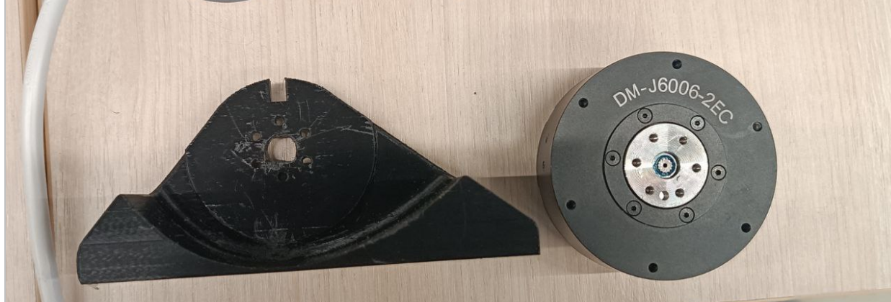
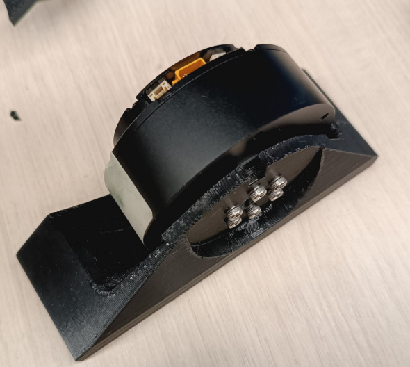
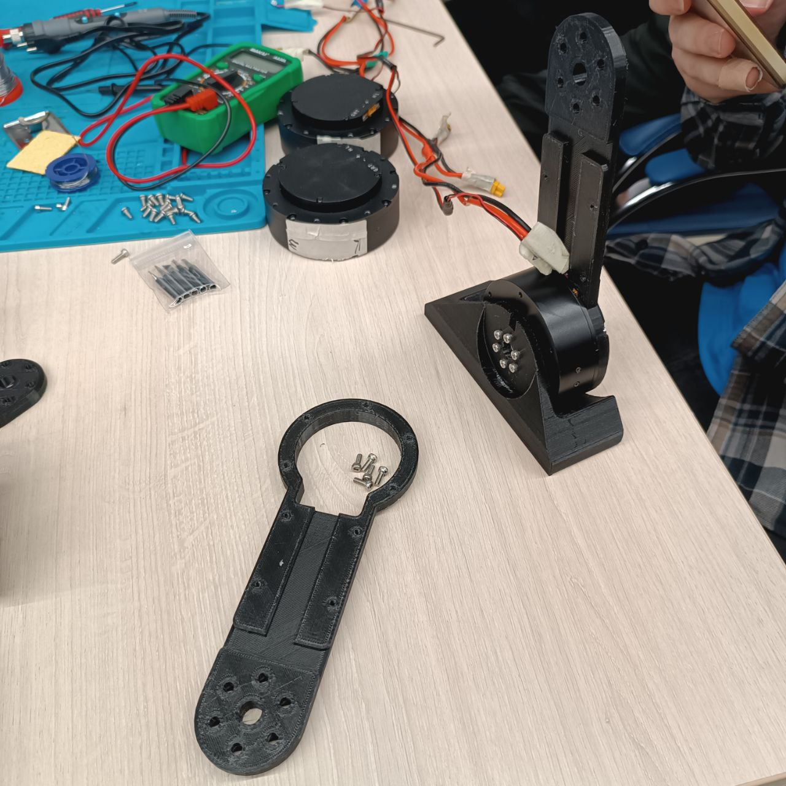
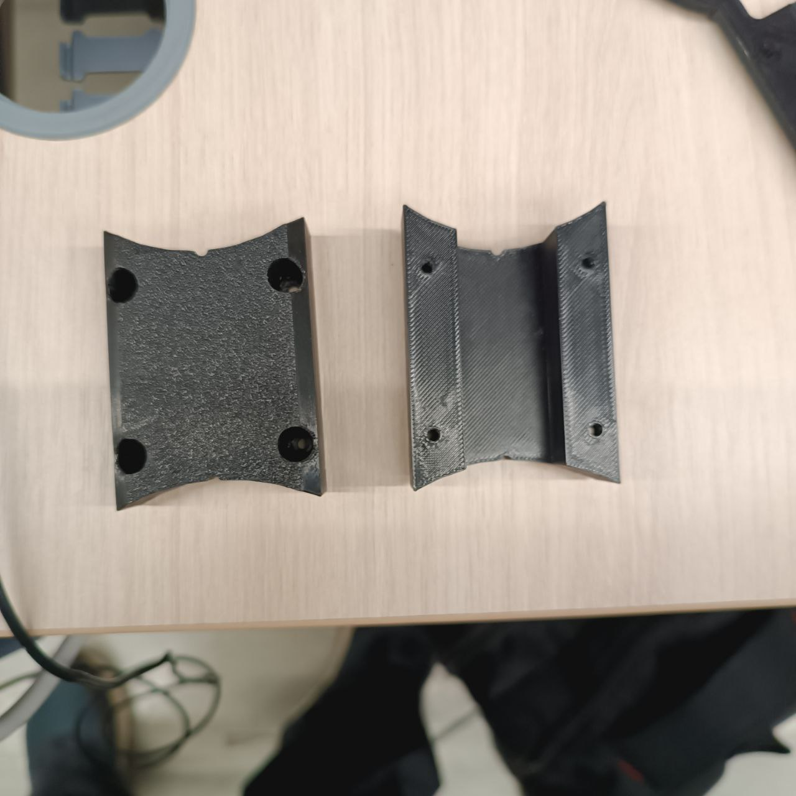
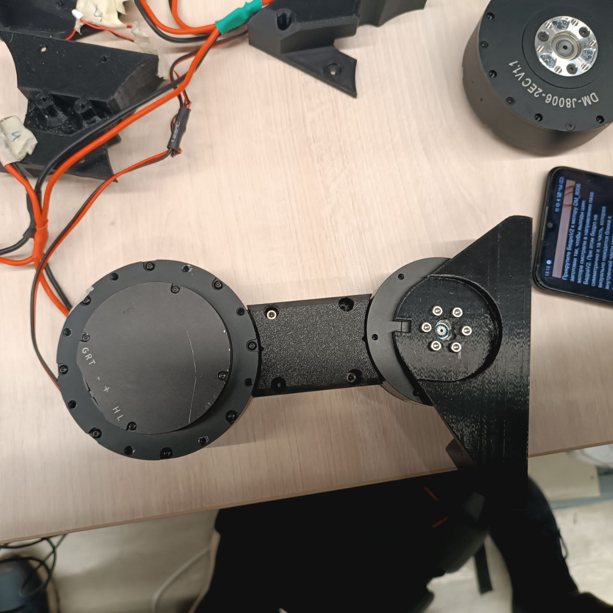
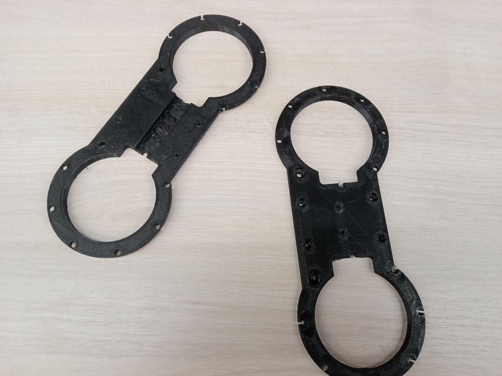
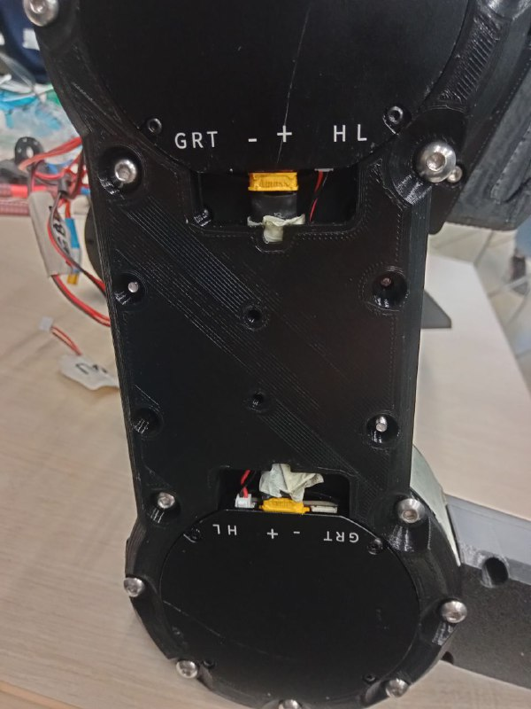

# Инструкция по сборке ног для робота Tinker

## 📑 Содержание

- [⚠️ Важные примечания перед началом сборки](#-важные-примечания-перед-началом-сборки)
- [📋 Необходимые компоненты](#-необходимые-компоненты)
  - [Моторы](#моторы)
  - [Крепеж](#крепеж)
- [🔧 Пошаговая инструкция сборки](#-пошаговая-инструкция-сборки)
  - [Этап 1: Сборка стопы](#этап-1-сборка-стопы)
    - [Шаг 1.1: Подготовка компонентов](#шаг-11-подготовка-компонентов)
    - [Шаг 1.2: Установка мотора на стопу](#шаг-12-установка-мотора-на-стопу)
    - [Шаг 1.3: Подключение проводки](#шаг-13-подключение-проводки)
  - [Этап 2: Сборка голени](#этап-2-сборка-голени)
    - [Шаг 2.1: Установка основной части голени](#шаг-21-установка-основной-части-голени)
    - [Шаг 2.2: Установка крышки голени](#шаг-22-установка-крышки-голени)
    - [Шаг 2.3: Прокладка проводки](#шаг-23-прокладка-проводки)
    - [Шаг 2.4: Установка мотора голени](#шаг-24-установка-мотора-голени)
  - [Этап 3: Сборка бедра](#этап-3-сборка-бедра)
    - [Шаг 3.1: Подготовка компонентов бедра](#шаг-31-подготовка-компонентов-бедра)
    - [Шаг 3.2: Установка мотора бедра](#шаг-32-установка-мотора-бедра)
    - [Шаг 3.3: Ориентация моторов](#шаг-33-ориентация-моторов)
    - [Шаг 3.4: Подключение проводки](#шаг-34-подключение-проводки)
    - [Шаг 3.5: Сборка бедра](#шаг-35-сборка-бедра)
    - [Шаг 3.6: Установка крышки бедра](#шаг-36-установка-крышки-бедра)
- [✅ Проверка сборки](#-проверка-сборки)
- [🔧 Дополнительные советы](#-дополнительные-советы)

---

## ⚠️ Важные примечания перед началом сборки

1. **Прошивка моторов**: Все моторы должны быть прошиты соответствующим образом (пронумерованы)

2. **Ориентация стопы**: 
   - Длинная сторона стопы определяется по усмотрению сборщика
   - Колени робота выгнуты назад
   - **Рекомендуемая ориентация**: длинная сторона стопы установлена назад, в сторону колена
   - Это обеспечивает более устойчивое положение, так как стопа находится ближе к центру тяжести

---

## 📋 Необходимые компоненты

### Моторы:
- DM-J6006 (5) - для стопы
- DM-8006 (4) - для голени  
- DM-8006 (3) - для бедра

### Крепеж:
- Винты М3x8 (для стопы и голени)
- Винты М3x12 (для крышки голени)
- Винты М3x10 (для крышки бедра)
- Винты М4x8 (для моторов)
- Гайки М3 (4 шт.)

---

## 🔧 Пошаговая инструкция сборки

### Этап 1: Сборка стопы

#### Шаг 1.1: Подготовка компонентов
- Возьмите стопу и мотор DM-J6006 (5)

#### Шаг 1.2: Установка мотора на стопу
- Установите DM-J6006 (5) на стопу на 6 винтов М3x8
- **Важно**: Винты должны смотреть шляпками наружу
- Прокрутите мотор так, чтобы порт смотрел наружу

#### Шаг 1.3: Подключение проводки
- Подключите проводку к мотору DM-J6006 (5)

---

### Этап 2: Сборка голени

#### Шаг 2.1: Установка основной части голени
- Возьмите основную часть голени
- Установите основную часть голени на ранее собранную стопу на 5 винтов М3x8

#### Шаг 2.2: Установка крышки голени
- Возьмите крышку голени

- Установите крышку голени, учитывая радиус крышки в зависимости от размера мотора
- Прикрутите крышку голени к основной части голени на 4 винта М3x12
- С обратной стороны закрутите 4 гайки на винты М3

#### Шаг 2.3: Прокладка проводки
- Проводку голени пропустите в Т-образный канал к внутренней стороне бедра

#### Шаг 2.4: Установка мотора голени
- Возьмите мотор DM-8006 (4)
- Прикрутите DM-8006 (4) к верхней части голени на 6 винтов М4x8

---

### Этап 3: Сборка бедра

#### Шаг 3.1: Подготовка компонентов бедра
- Возьмите основную деталь бедра и мотор DM-8006 (3)

#### Шаг 3.2: Установка мотора бедра
- Вставьте DM-8006 (3) во второе отверстие основной части бедра
- **Примечание**: Возможно, придется повернуть на 180 градусов, чтобы поменять отверстия основной части бедра местами (если электрическая часть уже сделана)

#### Шаг 3.3: Ориентация моторов
- Выставьте ориентацию моторов таким образом, чтобы они смотрели друг на друга (внутри бедренного канала)

#### Шаг 3.4: Подключение проводки
- Проводку, выходящую с голени, перебросьте на основную часть бедра

#### Шаг 3.5: Сборка бедра
- Прикрутите DM-8006 (3) к основной части бедра на 7 винтов М4x8
- Прикрутите основную деталь бедра к ранее собранной части через мотор DM-8006 (4) на 7 винтов М4x8
- Проденьте проводку в соответствующие каналы

#### Шаг 3.6: Установка крышки бедра
- Накройте основную часть бедра крышкой
- **Важно**: Крышка бедра отвечает за диапазон сгибания голени, так как работает как стопор
- Прикрутите крышку бедра на 4 винта М3x10

---

## ✅ Проверка сборки

После завершения сборки убедитесь, что:
- Все моторы правильно ориентированы
- Проводка аккуратно проложена в каналах
- Все винты затянуты
- Механизм сгибания работает плавно
- Крышка бедра не препятствует движению голени

---

## 🔧 Дополнительные советы

- При сборке следите за тем, чтобы не пережать проводку
- Проверяйте ориентацию моторов на каждом этапе
- При необходимости используйте смазку для плавности движения
- Сохраняйте все крепежные элементы в порядке
