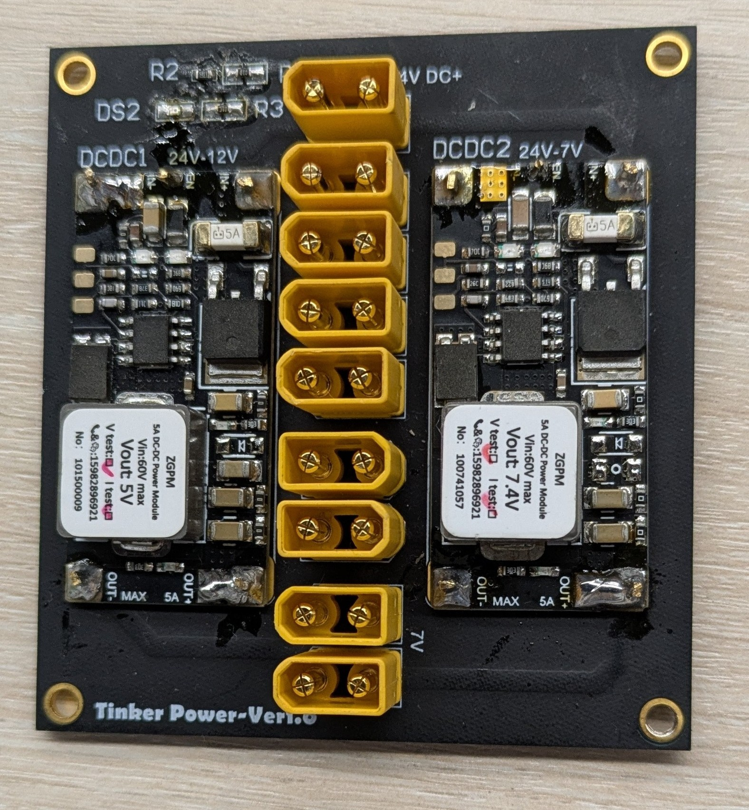
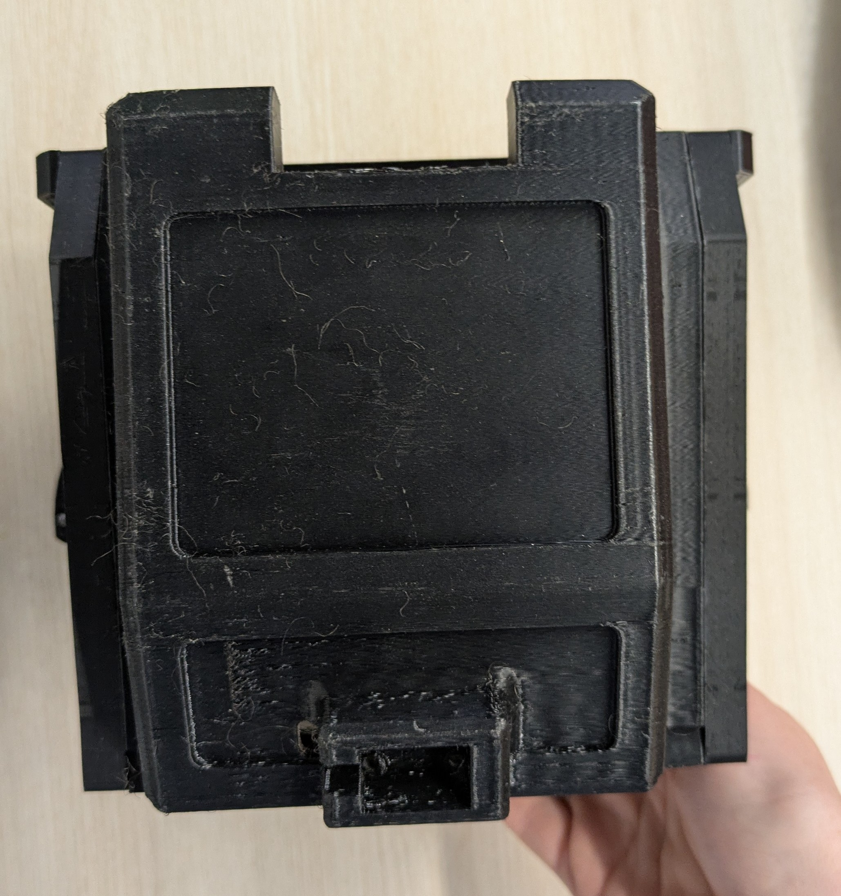
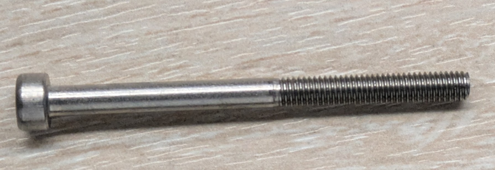
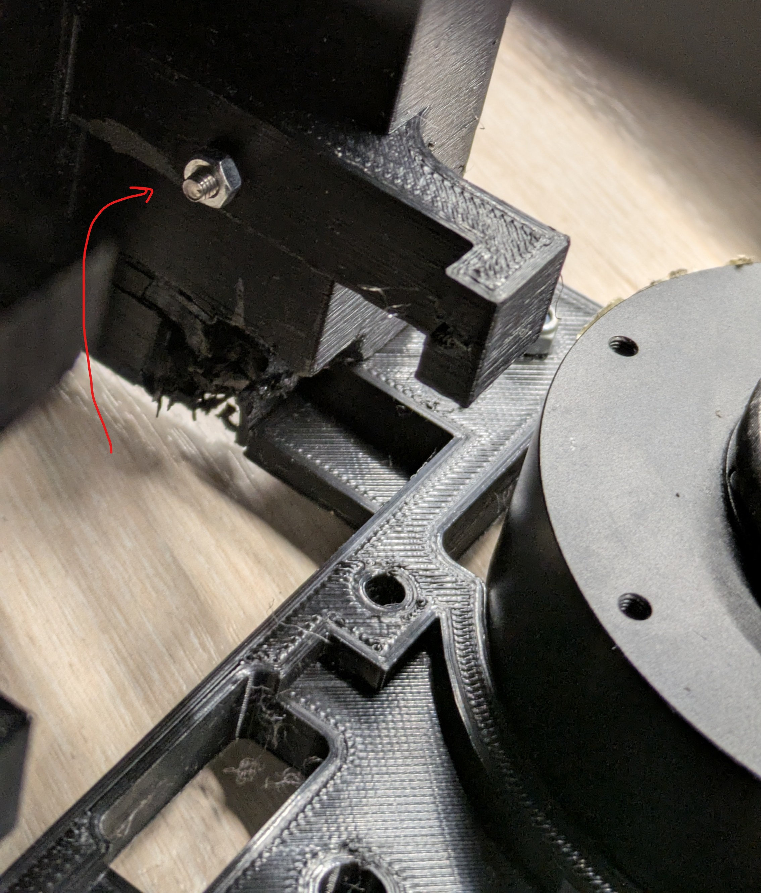
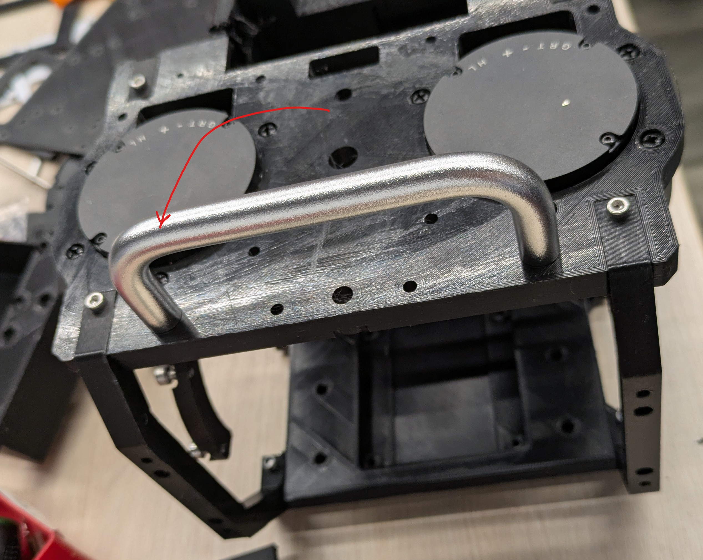
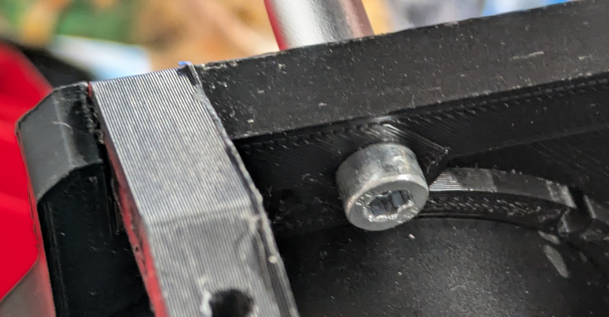
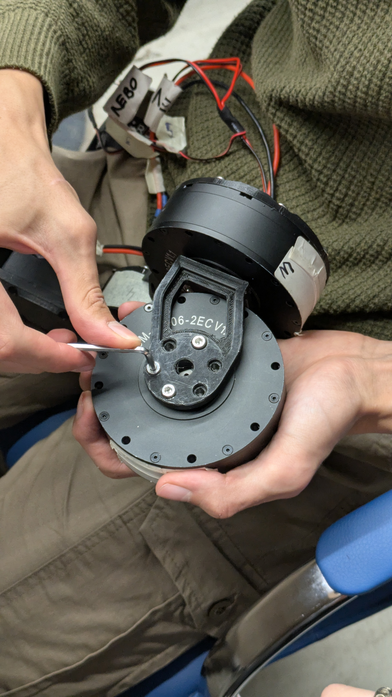
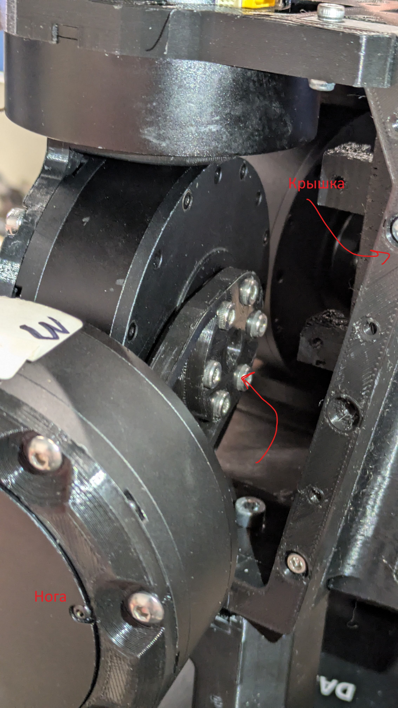
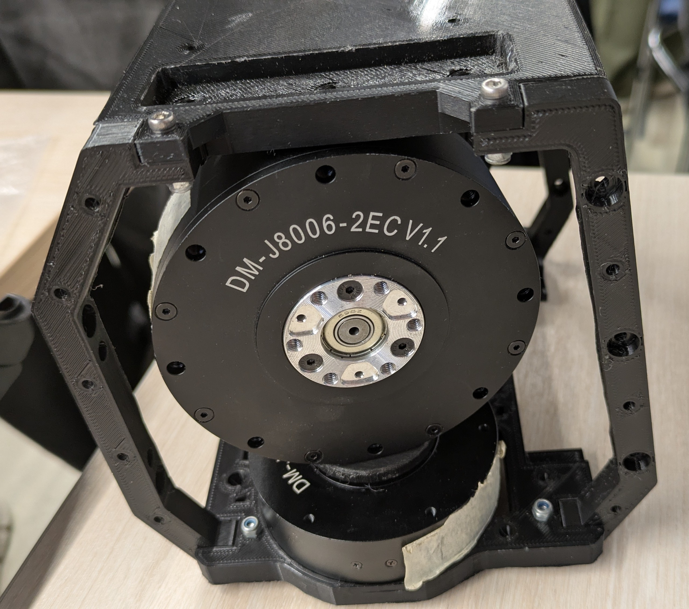

# Центральная часть (туловище)

## 📋 Обзор компонентов

Центральная часть робота Tinker состоит из следующих основных элементов:
- **6 больших моторов** (DM-J8006) для основных суставов ног
- **4 малых мотора** (DM-J6006) для поворотных суставов и стоп
- **Спаянная плата управления** с разъемами для всех моторов
- **Алюминиевая рама** для крепления компонентов
- **Углеродные пластины** для усиления конструкции

## 🔧 Подготовка к сборке

### Необходимые инструменты:
- Крестовая отвертка (PH2)
- Шестигранные ключи (2мм, 2.5мм, 3мм)
- Плоскогубцы
- Мультиметр для проверки соединений
- Изолента и кабельные стяжки

### Проверка компонентов:
1. **Моторы**: Убедитесь, что все моторы прошиты с правильными CAN ID
2. **Плата управления**: Проверьте целостность пайки и отсутствие коротких замыканий
3. **Механические детали**: Проверьте отсутствие трещин и деформаций

## ⚙️ Базовая конфигурация системы

### Сетевые настройки
- **Router Name**: `Tinker-2.4G-ID`  
- **Password**: `11111111`  
- **IP-адрес робота**: `192.168.1.100` (по умолчанию)
- **Порт управления**: `8080`

### 🔩 Конфигурация моторов

#### **Левая нога (STM32 CAN1)**  
| Сустав      | Тип мотора | CAN ID | Направление | Диапазон |
|------------|------------|--------|-------------|----------|
| Поворот        | 6006       | 1      | ±180°       | 360°     |
| Крен       | 8006       | 2      | ±90°        | 180°     |
| Бедро      | 8006       | 3      | ±120°       | 240°     |
| Голень       | 8006       | 4      | ±90°        | 180°     |
| Стопа       | 6006       | 5      | ±45°        | 90°      |

#### **Правая нога (STM32 CAN2)**  
| Сустав | Тип мотора | CAN ID | Направление | Диапазон |
| ----- | ---------- | ------ |-------------|----------|
| Поворот   | 6006       | 1      | ±180°       | 360°     |
| Крен  | 8006       | 2      | ±90°        | 180°     |
| Бедро | 8006       | 3      | ±120°       | 240°     |
| Голень  | 8006       | 4      | ±90°        | 180°     |
| Стопа  | 6006       | 5      | ±45°        | 90°      |

#### **Голова (STM32 CAN1)**  
| Сустав          | Тип мотора | CAN ID | Направление | Диапазон |
|---------------|------------|--------|-------------|----------|
| Поворот головы      | 3507       | 6      | ±180°       | 360°     |
| Наклон головы    | 3507       | 7      | ±60°        | 120°     |

### Проверка конфигурации моторов

1. **Подключение к CAN-шине**:
   - Левая нога: CAN1 (пины 1, 2)
   - Правая нога: CAN2 (пины 3, 4)
   - Голова: CAN1 (пины 5, 6)

2. **Проверка моторов**:
   - Убедитесь, что все моторы имеют правильные CAN ID
   - Проверьте целостность проводки CAN-шин
   - Убедитесь в отсутствии коротких замыканий

3. **Проверка нулевых позиций**:
   - Каждый мотор должен быть установлен в нулевую позицию
   - Проверьте, что моторы свободно вращаются в обе стороны
   - Убедитесь в отсутствии механических препятствий

# Тазобедренный сустав

## 🎯 Назначение и функции

Тазобедренный сустав является основным несущим элементом робота, обеспечивающим:
- **Поворотные движения** ног относительно туловища (моторы DM-J6006)
- **Креновые движения** для балансировки (моторы DM-J8006)
- **Передачу нагрузки** от ног к центральной части
- **Крепление** для всей системы ног

## 🔧 Этап 1: Установка поворотных моторов

### Подготовка центральной пластины
1. **Очистка поверхности**: Удалите пыль и загрязнения с центральной пластины
2. **Проверка отверстий**: Убедитесь, что все монтажные отверстия чистые и не засорены
3. **Маркировка**: Отметьте левую и правую стороны пластины для правильной ориентации

### Установка моторов DM-J6006-2EC

**Критически важно**: Максимальная длина болтов для моторов - **5мм**

**Пошаговая установка**:
1. **Позиционирование**: Установите моторы так, чтобы их разъемы были направлены наружу
2. **Выравнивание**: Убедитесь, что моторы расположены симметрично относительно центра
3. **Крепление**: Используйте болты M3x5 (максимум 5мм длины)
4. **Затяжка**: Затяните болты с моментом 0.8-1.2 Н·м
5. **Проверка**: Убедитесь, что моторы не имеют люфта и свободно вращаются

## 🔧 Этап 2: Установка крепежей для больших моторов

### Подготовка крепежных элементов

**Требования к крепежу**:
- **Длина болтов**: Максимум 5мм
- **Тип резьбы**: M4 для больших моторов
- **Материал**: Нержавеющая сталь A2-70
- **Покрытие**: Оцинковка для защиты от коррозии

### Подготовленный крепеж

**Проверка крепежа**:
1. **Визуальный осмотр**: Отсутствие дефектов резьбы
2. **Измерение длины**: Подтверждение максимальной длины 5мм
3. **Совместимость**: Проверка соответствия отверстиям в моторах

## 🔧 Этап 3: Установка боковых частей каркаса

### Левая сторона

**Процесс установки**:
1. **Ориентация**: Убедитесь, что левая часть каркаса установлена с правильной стороны
2. **Выравнивание**: Совместите монтажные отверстия с отверстиями в центральной пластине
3. **Предварительная фиксация**: Установите 2-3 болта для предварительного крепления
4. **Проверка геометрии**: Убедитесь, что углы составляют 90°
5. **Окончательное крепление**: Затяните все болты с равномерным усилием

### Правая сторона

**Симметричная установка**:
- Повторите те же шаги, что и для левой стороны
- Обеспечьте зеркальную симметрию относительно центральной оси

### Финальная проверка

**Контрольные точки**:
- [ ] Обе стороны установлены симметрично
- [ ] Все болты затянуты с правильным моментом
- [ ] Отсутствуют зазоры между деталями
- [ ] Каркас не имеет деформаций

## 🔧 Этап 4: Установка крышки

### Важное примечание
**Крупные моторы можно снять после примерки и установить позже** для удобства сборки.

### Крепежные элементы

**Тип крепежа**:
- **Болты**: M3x12 для крепления крышки
- **Гайки**: M3 с фланцем для надежного крепления
- **Шайбы**: Пружинные шайбы для предотвращения самоотвинчивания

### Установка крышки

**Процесс установки**:
1. **Позиционирование**: Установите крышку на каркас
2. **Выравнивание**: Совместите все монтажные отверстия
3. **Предварительная фиксация**: Установите болты в диагональном порядке
4. **Постепенная затяжка**: Затягивайте болты крест-накрест
5. **Финальная проверка**: Убедитесь в отсутствии зазоров

## 🔧 Этап 5: Установка ручки

### Позиционирование ручки

**Назначение ручки**:
- **Транспортировка**: Для переноски робота
- **Стабилизация**: Дополнительная точка опоры
- **Эргономика**: Удобство при работе с роботом

### Крепление снизу

**Процесс установки**:
1. **Определение места**: Ручка крепится к нижней части каркаса
2. **Подготовка отверстий**: Просверлите отверстия под крепеж
3. **Установка**: Зафиксируйте ручку болтами M4x16
4. **Проверка прочности**: Убедитесь, что ручка выдерживает вес робота

## 🔧 Этап 6: Установка упоров (сиденье робота)

### Рекомендация по установке
**По возможности используйте вплавляемые гайки** для более надежного крепления.

**Процесс установки**:
1. **Разметка**: Отметьте места установки упоров
2. **Подготовка**: Установите вплавляемые гайки (если возможно)
3. **Крепление**: Зафиксируйте упоры болтами M3x8
4. **Проверка**: Убедитесь в стабильности крепления

## 🔧 Этап 7: Установка ног

### Крепление к большим моторам

**Важные моменты**:
- **Симметрия**: Левая и правая ноги крепятся одинаково
- **Ориентация**: Убедитесь в правильном направлении установки
- **Крепеж**: Используйте болты M4x12 для надежного крепления

### Крышка передней части

**Обозначение**: Крышка передней части туловища робота обозначена как "крышка"

**Установка**:
1. **Позиционирование**: Установите крышку на переднюю часть
2. **Выравнивание**: Совместите с монтажными отверстиями
3. **Крепление**: Зафиксируйте болтами M3x10
4. **Проверка**: Убедитесь в отсутствии зазоров

### Финальный вид установленных моторов

**Контрольный список**:
- [ ] Все моторы установлены в правильной ориентации
- [ ] Крепеж затянут с правильным моментом
- [ ] Отсутствуют механические помехи
- [ ] Проводка не пережата и не повреждена

# Инструкция по сборке ног для робота Tinker

## Примечания:

1.  Моторы должны быть прошиты соответствующим образом (пронумерованы)

2.  Длинная сторона стопы определятся по усмотрению сборщика. Колени
    робота выгнуты назад. Оригинальная инструкция подразумевает
    положение длинной стороны стопы вперед, с выгнутым коленом назад. В
    нашей сборке длинная сторона стопы установлена назад, в сторону
    колена, таким образом стопа находится ближе к центру тяжести и
    положение более устойчивое.

## СБОРКА СТОПЫ

Берем стопу и мотор DM-J6006 (5)

Установите DM-J6006 (5) на стопу на 6 винтов М3x8

Винты должны смотреть шляпками наружу

Прокрутите мотор так, чтобы порт смотрел наружу

Подключите проводку к мотору DM-J6006 (5)

## СБОРКА ГОЛЕНИ

Берем основную часть голени

Установите основную часть голени на ранее собранную часть на 5 винтов
М3x8

Берем крышку голени

Установите крышку голени учитывая радиус крышки в зависимости от размера мотора.

Прикрутите крышку голени к основной части голени на 4 винта М3x12

С обратной стороны закрутите 4 гайки на винты М3.

Проводку голени пропускаем в Т-образный канал к внутренней стороне
бедра.

Берем DM_8006 (4)

Прикручиваем DM_8006 (4) к верхней части голени на 6 винтов М4x8

## СБОРКА БЕДРА

Берем основную деталь бедра, DM_8006 (3)

Вставляем DM_8006 (3) во второе отверстие основной части бедра

Возможно, придется повернуть на 180 градусов чтобы поменять отверстия
основной части бедра местами (Если электрическая часть уже сделана)

Выставляем ориентацию моторов таким образом, чтобы они смотрели друг на
друга (внутри бедренного канала)

Проводку выходящую с голени перебросить на основную часть бедра

Прикручиваем DM_8006 (3) к основной части бедра на 7 винтов М4x8

Прикручиваем основную деталь бедра к ранее собранной части через мотор
DM_8006 (4) на 7 винтов М4x8, продевая проводку в соответствующие каналы

Накрываем основную часть бедра крышкой. Крышка бедра отвечает за
диапазон сгибания голени, так как работает как стопор.

Прикручиваем крышку бедра на 4 винта М3x10

## ⚠️ Важные примечания по сборке

### 1. Прошивка моторов
- **Обязательно**: Все моторы должны быть прошиты с соответствующими CAN ID
- **Проверка**: Убедитесь, что каждый мотор имеет правильный CAN ID
- **Калибровка**: Выполните калибровку нулевых позиций перед сборкой

### 2. Ориентация стопы
**Критически важно**: Длинная сторона стопы определяется по усмотрению сборщика.

**Варианты установки**:
- **Оригинальная схема**: Длинная сторона стопы вперед, колени выгнуты назад
- **Рекомендуемая схема**: Длинная сторона стопы назад, в сторону колена

**Преимущества рекомендуемой схемы**:
- Стопа находится ближе к центру тяжести
- Более устойчивое положение робота
- Улучшенная балансировка при ходьбе

## 🔧 Сборка стопы

### Компоненты
- **Стопа**: Углеродная пластина с монтажными отверстиями
- **Мотор DM-J6006** (CAN ID 5): Поворотный мотор для голеностопа
- **Крепеж**: 6 винтов M3x8

### Пошаговая сборка

#### Шаг 1: Подготовка стопы
1. **Очистка**: Удалите пыль и загрязнения с поверхности стопы
2. **Проверка отверстий**: Убедитесь, что все монтажные отверстия чистые
3. **Ориентация**: Определите направление длинной стороны стопы

#### Шаг 2: Установка мотора DM-J6006

**Процесс установки**:
1. **Позиционирование**: Установите мотор DM-J6006 (CAN ID 5) на стопу
2. **Выравнивание**: Совместите монтажные отверстия мотора с отверстиями стопы
3. **Крепление**: Зафиксируйте мотор 6 винтами M3x8
4. **Ориентация**: Винты должны смотреть шляпками наружу
5. **Поворот мотора**: Прокрутите мотор так, чтобы порт смотрел наружу

#### Шаг 3: Подключение проводки

**Подключение проводов**:
1. **CAN-шина**: Подключите CAN_H и CAN_L к соответствующим контактам
2. **Питание**: Подключите VCC (24V) и GND
3. **Проверка**: Убедитесь в надежности контактов
4. **Изоляция**: Заизолируйте оголенные контакты

## 🔧 Сборка голени

### Компоненты
- **Основная часть голени**: Углеродная пластина
- **Крышка голени**: Защитная крышка с учетом радиуса мотора
- **Мотор DM-J8006** (CAN ID 4): Коленный мотор
- **Крепеж**: 5 винтов M3x8, 4 винта M3x12, 4 гайки M3, 6 винтов M4x8

### Пошаговая сборка

#### Шаг 1: Установка основной части голени
1. **Подготовка**: Возьмите основную часть голени
2. **Соединение**: Установите основную часть голени на ранее собранную стопу
3. **Крепление**: Зафиксируйте 5 винтами M3x8
4. **Проверка**: Убедитесь в отсутствии люфта

#### Шаг 2: Установка крышки голени
1. **Подготовка крышки**: Возьмите крышку голени

2. **Учет радиуса**: Установите крышку голени, учитывая радиус крышки в зависимости от мотора
3. **Крепление**: Прикрутите крышку голени к основной части на 4 винта M3x12
4. **Обратная сторона**: С обратной стороны закрутите 4 гайки на винты M3

#### Шаг 3: Прокладка проводки
**Важно**: Проводку голени пропускаем в Т-образный канал к внутренней стороне бедра.

**Процесс прокладки**:
1. **Подготовка канала**: Убедитесь, что Т-образный канал чистый
2. **Прокладка проводов**: Аккуратно пропустите провода через канал
3. **Фиксация**: Зафиксируйте провода, чтобы они не болтались
4. **Проверка**: Убедитесь, что провода не пережаты

#### Шаг 4: Установка коленного мотора
1. **Подготовка мотора**: Возьмите мотор DM-J8006 (CAN ID 4)
2. **Крепление**: Прикрутите мотор к верхней части голени на 6 винтов M4x8
3. **Ориентация**: Убедитесь, что разъем мотора направлен в нужную сторону
4. **Проверка**: Убедитесь в отсутствии люфта

## 🔧 Сборка бедра

### Компоненты
- **Основная деталь бедра**: Углеродная пластина с монтажными отверстиями
- **Мотор DM-J8006** (CAN ID 3): Бедренный мотор
- **Крышка бедра**: Защитная крышка, работающая как стопор
- **Крепеж**: 6 винтов M4x8, 4 винта M4x10

### Пошаговая сборка

#### Шаг 1: Установка бедренного мотора
1. **Подготовка**: Возьмите основную деталь бедра и мотор DM-J8006 (CAN ID 3)
2. **Позиционирование**: Вставьте мотор во второе отверстие основной части бедра
3. **Ориентация**: Возможно, придется повернуть на 180° чтобы поменять отверстия местами (если электрическая часть уже сделана)
4. **Выравнивание**: Выставьте ориентацию моторов так, чтобы они смотрели друг на друга (внутри бедренного канала)

#### Шаг 2: Прокладка проводки
1. **Переброс проводов**: Проводку, выходящую с голени, перебросьте на основную часть бедра
2. **Прокладка в каналы**: Проделайте проводку в соответствующие каналы
3. **Фиксация**: Зафиксируйте провода, чтобы они не мешали движению

#### Шаг 3: Крепление бедренного мотора
1. **Крепление**: Прикрутите мотор DM-J8006 (CAN ID 3) к основной части бедра на 6 винтов M4x8
2. **Соединение**: Прикрутите основную деталь бедра к ранее собранной части через мотор DM-J8006 (CAN ID 4) на 6 винтов M4x8
3. **Прокладка**: Продевая проводку в соответствующие каналы

#### Шаг 4: Установка крышки бедра
1. **Назначение**: Крышка бедра отвечает за диапазон сгибания голени, так как работает как стопор
2. **Установка**: Накройте основную часть бедра крышкой
3. **Крепление**: Прикрутите крышку бедра на 4 винта M4x10
4. **Проверка**: Убедитесь, что крышка не ограничивает движение больше необходимого

## 🔧 Финальная проверка ноги

### Контрольный список
- [ ] Все моторы установлены в правильной ориентации
- [ ] CAN ID соответствуют схеме подключения
- [ ] Проводка проложена без пережатий
- [ ] Все крепежные элементы затянуты с правильным моментом
- [ ] Отсутствуют механические помехи
- [ ] Диапазоны движения соответствуют техническим требованиям

### Тестирование
1. **Проверка движения**: Вручную проверьте движение каждого сустава
2. **Проверка ограничений**: Убедитесь, что стопоры работают корректно
3. **Проверка проводки**: Убедитесь, что провода не пережаты при движении
4. **Проверка крепежа**: Убедитесь, что все соединения надежны

## 🔄 Симметричная сборка

**Важно**: Левая и правая ноги собираются симметрично, но с зеркальной ориентацией.

**Особенности**:
- **Левая нога**: CAN ID 1-5 на CAN1
- **Правая нога**: CAN ID 1-5 на CAN2  
- **Ориентация**: Обе ноги должны быть зеркальными относительно центральной оси
- **Проводка**: Проводка должна быть проложена симметрично

#### Ссылки:
[https://github.com/Yuexuan9/Tinker](https://github.com/Yuexuan9/Tinker)
[https://github.com/golaced/OmniBotSeries-Tinker](https://github.com/golaced/OmniBotSeries-Tinker) v2
[https://github.com/opensourcerobot/Alpha_Human_gym](https://github.com/opensourcerobot/Alpha_Human_gym) v3
[https://github.com/EgorSolodnikov/Tinker_Sber/tree/spi_communicator](https://github.com/EgorSolodnikov/Tinker_Sber/tree/spi_communicator)

## 🔧 Финальная проверка сборки

После завершения механической сборки выполните следующие проверки:

### Контрольный список сборки
- [ ] Все моторы установлены в правильной ориентации
- [ ] CAN ID соответствуют схеме подключения
- [ ] Проводка проложена без пережатий
- [ ] Все крепежные элементы затянуты с правильным моментом
- [ ] Отсутствуют механические помехи
- [ ] Диапазоны движения соответствуют техническим требованиям

### Проверка механических соединений
1. **Проверка моторов**:
   - Убедитесь, что все моторы свободно вращаются
   - Проверьте отсутствие люфта в соединениях
   - Убедитесь в правильности ориентации

2. **Проверка проводки**:
   - Убедитесь, что провода не пережаты
   - Проверьте целостность изоляции
   - Убедитесь в надежности контактов

3. **Проверка крепежа**:
   - Убедитесь, что все болты затянуты
   - Проверьте отсутствие трещин в деталях
   - Убедитесь в стабильности конструкции

### Готовность к программной настройке
После завершения механической сборки робот готов к:
- Прошивке контроллеров
- Настройке программного обеспечения
- Калибровке системы
- Первому запуску

**Важно**: Перед первым запуском убедитесь, что все механические соединения проверены и исправны.

## 📚 Дополнительные ресурсы

### Документация по сборке
- **Официальная документация**: [Tinker Assembly Guide](https://github.com/Yuexuan9/Tinker)
- **3D модели**: [Tinker CAD Files](https://github.com/Yuexuan9/Tinker/tree/main/cad)
- **Схемы подключения**: [Tinker Wiring Diagrams](https://github.com/Yuexuan9/Tinker/tree/main/docs/wiring)

### Сообщество
- **GitHub Issues**: [Tinker Issues](https://github.com/Yuexuan9/Tinker/issues)
- **Discord**: [Tinker Community](https://discord.gg/tinker)
- **Форум**: [Tinker Forum](https://forum.tinker.com)